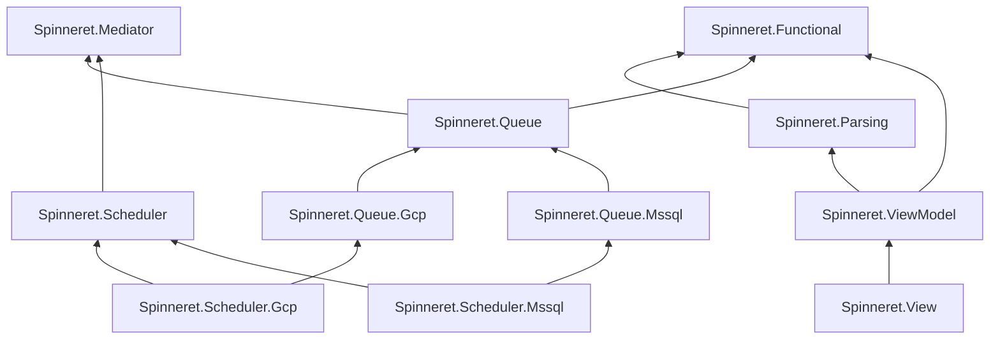

<p align="center">
  <picture>
    <source media="(prefers-color-scheme: dark)" srcset="docs/logo-dark.svg">
    
  </picture>
</p>

<h3 align="center">Spin up your .NET app.</h3>

<p align="center">
  <a href="https://www.nuget.org/packages?q=Spinneret"></a>
  
  
</p>

---

A **spinneret** is the organ a spider uses to spin its web. It doesn't extrude one thread — it produces different silks for different jobs: dragline for the frame, radials that carry every signal, sticky spiral to catch what flies in, egg-sac silk to keep things safe until they hatch.

**Spinneret** is that organ for .NET: small, sharply focused packages that spin the threads a serious application hangs from — results, requests, validation, queues, schedules, and a Blazor MVVM layer. Infrastructure-specific implementations stay at the edges. Use one thread, or weave them all.

## Why Spinneret

Utility libraries tend to be junk drawers. Spinneret is the opposite: every package is small enough to read in one sitting, and the whole library is built around a few consistent principles.

- **Errors are values.** `Result<TOk, TError>` flows through parsing, mediation, and queue delivery. Exceptions are reserved for the exceptional.
- **Parse, don't validate.** A boundary produces a typed model or a complete, localizable list of property errors — never a half-trusted DTO.
- **Your app owns its behavior.** Retry policy is code on the command type, not YAML in a cloud console. A typo fails the host at boot, not a delivery at 2 a.m.
- **A wait is not a failure.** Deferred work is re-enqueued without burning retry attempts. Dead letters are for the truly dead.
- **Infrastructure is a seam.** Core packages are provider-agnostic; GCP and SQL Server adapters live in separate packages. Changing infrastructure means swapping a package, not rewriting your app.

## The silk

| Package | In the web | What it spins |
|---|---|---|
| `Spinneret.Functional` | **The dragline** | `Result` / `Either` with task and LINQ combinators — the load-bearing thread every other package hangs from. |
| `Spinneret.Mediator` | **The radials** | In-process request dispatch with declarative, tag-invalidated caching. A spider reads the world through vibrations in its radials; so does your app. |
| `Spinneret.Parsing` | **The sticky spiral** | Parse-don't-validate boundaries: one pass, every invalid property caught and localized. Nothing gets through that shouldn't. |
| `Spinneret.Queue` | **The egg sac** | A durable command queue where the application owns the retry policy — attempts, backoff, channels, dead-lettering — per command type. Safe until it hatches. |
| `Spinneret.Queue.Gcp` | | Google Cloud Tasks transport with an OIDC-authenticated dispatch endpoint. |
| `Spinneret.Queue.Mssql` | | SQL Server-backed durable queue transport. |
| `Spinneret.Scheduler` | **The nightly respin** | Recurring jobs declared in code and installed idempotently at startup. Orb-weavers rebuild their web every night; so do your jobs. |
| `Spinneret.Scheduler.Gcp` | | Firestore-backed scheduling with transactional dispatch. |
| `Spinneret.Scheduler.Mssql` | | SQL Server-backed scheduling with transactional dispatch. |
| `Spinneret.ViewModel` | **The attachment discs** | MVVM for Blazor: bindable view models, two-way bindings with conversion and validation state, row collections, nested view models — the silk cement that fastens view to model. |
| `Spinneret.View` | **The hub** | `ViewBase<T>` components that resolve their view model from DI, with lifecycle state and app-wide refresh coordination. Where the spider sits and feels everything. |

## Spinning up

```sh
dotnet add package Spinneret.Mediator
```

```csharp
services.AddMediator(typeof(Program).Assembly);
```

Packages that need wiring expose an `Add*` call; discovery happens once at startup, never at runtime.

### The dragline — `Spinneret.Functional`

Failures travel the same thread as successes, so nothing falls off the web:

```csharp
public Result<Employee, PromotionError> Promote(Employee employee) =>
    Result.FromNullable(employee.Manager, () => PromotionError.NoManager)
        .Bind(manager => manager.CanApprove
            ? Result.Ok<Employee, PromotionError>(employee with { Level = employee.Level + 1 })
            : Result.Error<Employee, PromotionError>(PromotionError.NotAuthorized));

// Exactly one place decides what an error looks like at the edge:
return result.Reduce<IResult>(
    employee => Results.Ok(employee),
    error => Results.UnprocessableEntity(error));
```

### The radials — `Spinneret.Mediator`

Requests are records, handlers are classes, and caching is a declaration — with tag-based invalidation so writes shake exactly the threads that matter:

```csharp
[Cache(seconds: 300, CacheTag.Employees)]
public record GetEmployees : IRequest<IReadOnlyList<EmployeeDto>>;

[InvalidateCache(CacheTag.Employees)]
public record AddEmployee(string Name) : IRequest<Unit>;

public class GetEmployeesHandler : IRequestHandler<GetEmployees, IReadOnlyList<EmployeeDto>>
{
    public Task<IReadOnlyList<EmployeeDto>> Handle(GetEmployees request, CancellationToken ct) => …;
}

var employees = await mediator.Send(new GetEmployees());   // cached, request-coalesced
await mediator.Send(new AddEmployee("Charlotte"));         // …and now it isn't
```

Concurrent identical requests share one in-flight task, so a cache miss costs one execution, not one per caller.

### The sticky spiral — `Spinneret.Parsing`

The boundary catches *everything* wrong with the input in a single pass and hands back either a fully typed model or every property error at once — ready to localize, ready to bind to a form:

```csharp
var result = parser.Parse(dto, p => new CreateEmployee(
    Name:  p.Require(x => x.Name),
    Email: p.Require(x => x.Email, Email.Parse),        // any Result-returning parser plugs in
    Rate:  p.Optional(x => x.Rate, EmploymentRate.Parse)));
```

`Spinneret.ViewModel` reuses the same parser against view models, binding each error to the field that caused it — one validation model from HTTP edge to form field.

### The egg sac — `Spinneret.Queue`

Commands are mediator requests with a delivery policy *on the type*. The policy is parsed at boot, so a typo fails the host, not a 3 a.m. delivery:

```csharp
[QueuePolicy(Channel = "fortnox", MaxAttempts = 8,
             MinBackoff = "00:00:30", OnExhausted = ExhaustedAction.DeadLetter)]
public record PushEmployeeToFortnox(Guid EmployeeId) : IRequest<Unit>;

await queue.Enqueue(new PushEmployeeToFortnox(employee.Id));
```

Handlers speak a failure *vocabulary*, not a boolean:

```csharp
// Never going to work — dead-letter immediately, retrying is pointless:
throw new QueueHandlerPermanentException("Employee no longer exists.");

// Rate-limited — re-enqueue later WITHOUT consuming a retry attempt:
throw new QueueHandlerRetryAfterException(TimeSpan.FromMinutes(10));
```

`Spinneret.Queue.Gcp` and `Spinneret.Queue.Mssql` provide the transport while the core queue owns delivery semantics. The GCP adapter uses Google Cloud Tasks with OIDC-authenticated dispatch; the MSSQL adapter uses SQL Server. The application-facing queue API stays the same either way.

### The nightly respin — `Spinneret.Scheduler`

A recurring job is an interface, not infrastructure. Register it in DI and it installs itself idempotently at startup:

```csharp
public class RemindProjectMonthClose : IRecurringJob
{
    public string Key => "project-month-close-reminder";
    public Schedule Schedule => Schedule.Cron("0 3 * * *", "Europe/Stockholm");
    public IRequest<Unit> CreateRequest() => new SendMonthCloseReminders();
}
```

Or inline, where a class would be noise:

```csharp
services.AddRecurringJob(
    "project-month-close-reminder",
    Schedule.Cron("0 3 * * *", "Europe/Stockholm"),
    () => new SendMonthCloseReminders());
```

Schedules are cron expressions — five fields, or six to schedule to the second — evaluated in an explicit IANA time zone, so a slot keeps its wall-clock time across DST. The zone travels with the schedule in its canonical string form (`cron:Europe/Stockholm:0 3 * * *`), which is how a schedule is persisted and how `Schedule.Parse` reads one back. Times are plain `DateTimeOffset`: the scheduler packages take no date/time dependency, so they never impose one on you.

To vary the cadence per environment, read the expression from configuration where the job is declared — staging sweeps every five minutes, production runs at 03:00, and the declaration is still the one place the schedule is decided:

```csharp
services.AddRecurringJob(
    "project-month-close-reminder",
    Schedule.Parse(builder.Configuration["Jobs:MonthClose"]!),
    () => new SendMonthCloseReminders());
```

A job class does the same by injecting whatever it already binds — `public Schedule Schedule => Schedule.Parse(options.Value.Schedule);`. Occurrences arrive only as promptly as the provider's dispatch sweep runs.

Deleting a job from code does **not** stop it. Its definition is durable, so it keeps dispatching with nothing left in the codebase to explain it. Retire the key to remove it:

```csharp
services.RetireRecurringJob("project-month-close-reminder");
```

The installer unregisters retired keys at startup, next to installing the declared ones — so the removal travels with the deploy and shows up in review. Leave the line in for at least one full deploy: while old instances are still running they re-install the job, and the retirement only wins once the last one is gone. Retiring is idempotent and never touches one-shot jobs. Registering two jobs under one key, or declaring and retiring the same key, fails startup rather than silently dropping a job.

The scheduler itself is infrastructure-agnostic. `Spinneret.Scheduler.Gcp` provides Firestore-backed scheduling with transactional dispatch, while `Spinneret.Scheduler.Mssql` provides the SQL Server-backed equivalent. The job declaration and application-facing scheduling model stay the same.

### The hub — `Spinneret.View` + `Spinneret.ViewModel`

Blazor components that receive a view model from DI instead of building their own state, with an explicit lifecycle and app-wide refresh coordination:

```razor
@inherits ViewBase<EmployeesViewModel>

@if (State == ViewState.Initialized)
{
    <input @bind="ViewModel.SearchText" />
}
```

View models are plain `INotifyPropertyChanged` classes with typed two-way bindings, conversion errors that land in a validation state, nested view models, and observable row collections — MVVM as you know it, wired for Blazor's render model.

## Anatomy

Each thread stands alone; together they make a web. The core packages remain provider-agnostic — provider-specific packages such as `.Gcp` and `.Mssql` keep infrastructure concerns at the edges.



## Why "Spinneret"?

Because the pun was sitting right there: spiders spin webs, and this spins up **.NET** web apps.

But the metaphor holds past the first laugh. A spinneret produces *different* silks from *one* organ — structural thread, signal thread, capture thread, protective thread — and a spider combines them into something far stronger than any single strand. That's the design here: small specialized packages, a consistent set of principles, woven together.

**Is it web-scale?** It is literally a web.

## License

MIT. Spin freely.
